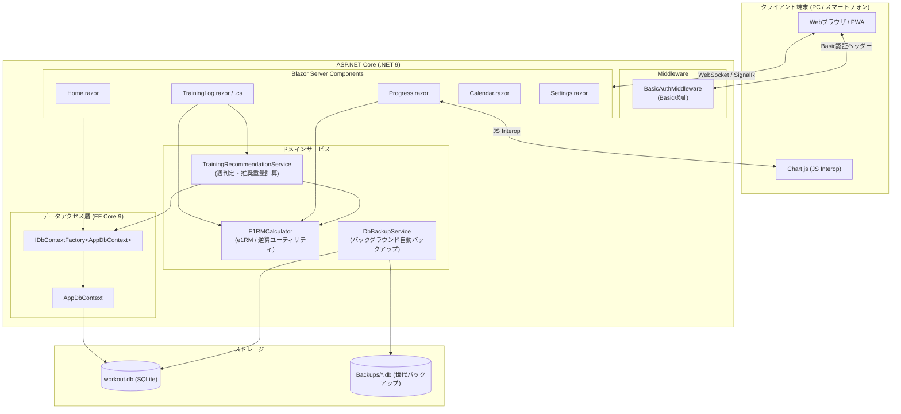
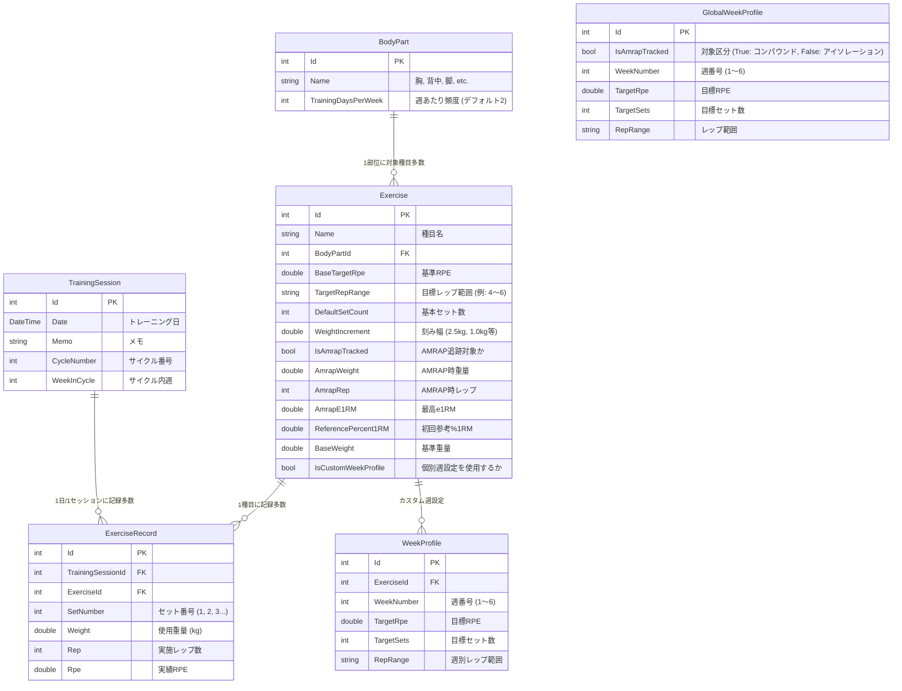

# システムアーキテクチャ & 設計ドキュメント

本ドキュメントでは、**WorkoutTracker** のシステム設計、データモデル、ピリオダイゼーション計算アルゴリズム、および内部コンポーネントの構造について解説します。

---

## 1. システム全体構成

WorkoutTracker は、**.NET 9** 上で動作する **Blazor Interactive Server** アプリケーションです。
クライアント（Webブラウザ/スマートフォン）とサーバー間は WebSocket (SignalR) を介してリアルタイムに双方向通信を行い、高速かつ滑らかなUI操作を実現しています。

---

## 2. ピリオダイゼーション & 推奨重量計算アルゴリズム

### 2.1 6週サイクルのフェーズ構成

本システムは、筋肥大と筋力向上を最大化し、疲労を管理するための **6週間ピリオダイゼーションサイクル** を実装しています。

| 週 (Week) | フェーズ名 | 目的 | コンパウンド (AMRAP対象) 目標RPE | アイソレーション 目標RPE | セット数の挙動 |
|:---|:---|:---|:---:|:---:|:---|
| **Week 1** | **漸進①** | 導入・フォーム定着 | 7.0 | 7.0 | 基本セット数 |
| **Week 2** | **漸進②** | 負荷増加フェーズ | 7.5 | 7.5 | ボリューム増加（+1〜2セット） |
| **Week 3** | **漸進③** | 負荷ピーク進行 | 8.0 | 8.0 | ボリューム最大（最大5セット） |
| **Week 4** | **高強度** | 神経系刺激・強度重視 | 9.0 | 8.0 | セット数を絞り強度優先 |
| **Week 5** | **AMRAP評価** | 現状の最大能力テスト | 9.5 (実質MAX挑戦) | 7.5 | 2セット (e1RM更新判定) |
| **Week 6** | **疲労抜き** | デロード（積極的休養） | 7.0 | 7.5 | 2セット (疲労回復・次サイクル準備) |

### 2.2 推定1RM (e1RM) 計算式 (`E1RMCalculator.cs`)

Epleyの公式をベースに、RPE（主観的運動強度・残り可能レップ数）の概念を組み込んだ計算式を使用しています。

$$\text{e1RM} = \text{Weight} \times \left(1 + \frac{\text{Rep} + 10 - \text{RPE}}{30}\right)$$

* 例: $100\text{ kg} \times 5\text{ reps (RPE 8.0)}$ の場合:
  $$\text{e1RM} = 100 \times \left(1 + \frac{5 + 10 - 8.0}{30}\right) = 100 \times \left(1 + \frac{7}{30}\right) \approx 123.3\text{ kg}$$

### 2.3 推奨重量の逆算式

現在の推定1RMから、その週の目標RPEおよび目標レップ数中央値（`TargetMidRep`）に対応する重量を逆算します。

$$\text{RecommendedWeight} = \text{RoundToIncrement}\left( \frac{\text{e1RM}}{1 + \frac{\text{TargetMidRep} + 10 - \text{TargetRPE}}{30}}, \text{WeightIncrement} \right)$$

* **AMRAP週 (Week 5) の場合**:
  推定1RMの80%を目標重量として算出します:
  $$\text{RecommendedWeight} = \text{RoundToIncrement}\left( \text{e1RM} \times 0.8, \text{WeightIncrement} \right)$$

### 2.4 サイクル内週番号の自動算出ロジック (`TrainingRecommendationService.cs`)

部位ごとに1週間あたりのトレーニング頻度（`TrainingDaysPerWeek`）が異なるため、該当部位の過去のユニークセッション数から動的に現在週を算出します。

$$\text{CurrentWeek} = \left( \frac{\text{DistinctSessionCount} - 1}{\text{TrainingDaysPerWeek}} \right) \bmod 6 + 1$$

* 例: 胸トレ頻度が週2回（`TrainingDaysPerWeek = 2`）の場合:
  * セッション1回目・2回目 $\rightarrow$ Week 1
  * セッション3回目・4回目 $\rightarrow$ Week 2
  * セッション5回目・6回目 $\rightarrow$ Week 3
  * セッション7回目・8回目 $\rightarrow$ Week 4
  * セッション9回目・10回目 $\rightarrow$ Week 5 (AMRAP)
  * セッション11回目・12回目 $\rightarrow$ Week 6 (デロード)
  * セッション13回目 $\rightarrow$ 次サイクルの Week 1

---

## 3. データモデル (ER図 & エンティティ仕様)

---

## 4. 設計上の重要ポイント & プラクティス

### 4.1 Blazor Server と DbContext のライフサイクル管理
Blazor Server は単一の SignalR 接続（長寿命サーキット）で動作するため、スコープ付き DbContext を画面全体で使い回すとスレッドセーフティ違反やメモリ肥大化が発生します。
本プロジェクトでは **`IDbContextFactory<AppDbContext>`** を使用し、各操作・画面描画ごとに `await using var context = await DbFactory.CreateDbContextAsync()` で短寿命のコンテキストを生成・破棄するベストプラクティスを徹底しています。

### 4.2 セッションの遅延作成 (Lazy Session Creation)
日付画面を開いただけで不要な空レコードがDBに作成されるのを防ぐため、`TrainingLog.razor.cs` では最初のセット保存時（`SaveRecord`）に初めて `TrainingSession` レコードを生成する遅延作成パターンを採用しています。

### 4.3 自動世代バックアップ (`DbBackupService.cs`)
アプリケーション起動時に SQLite データベースファイルを `Backups/workout_yyyyMMdd_HHmmss.db` に複製し、直近14世代を超える古いバックアップを自動削除するホストサービスを常駐させています。
